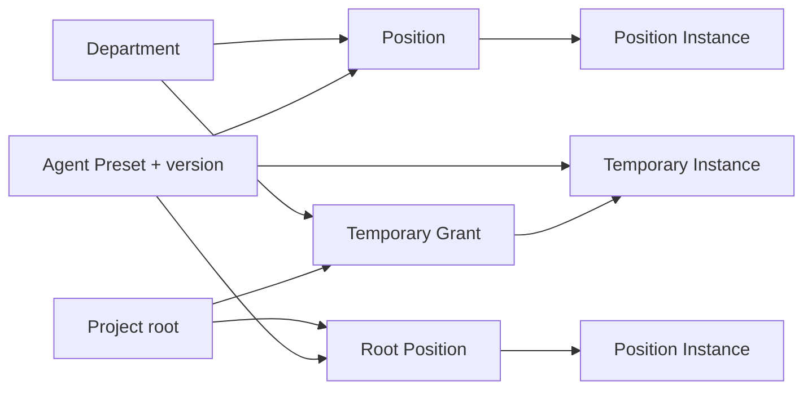

# 组织对象与身份契约

状态：`approved-design`

本契约定义项目组织中部门、Agent 能力模板、正式岗位和运行实例的稳定边界。它只回答“对象是什么、如何标识、何时需要审批”，不保存具体项目的当前组织状态；实际状态与历史由 `organization-registry.md` 定义的 Organization Registry 记录。

## 核心对象

| 对象 | 定义 | 持久性 | 审批边界 |
|---|---|---|---|
| Department | 承载长期职责、权限、预算、事实源和管理边界的组织单元 | 长期 | 创建、拆分、合并、删除或扩大边界必须事前人工审批 |
| Agent Preset | 可复用的能力定义，组合指令、Skill、工具、Provider 和 Contract 引用 | 可版本化复用 | 可以自动生成草案；未批准版本不能绑定到正式岗位或获得执行权限 |
| Position | 部门或项目根层中的正式岗位，定义长期职责、所有权、权限上限和独立验收关系 | 长期 | 创建、删除、转移、扩权或改变独立验收关系必须事前人工审批 |
| Agent Instance | 使用确定 Preset 版本实际执行工作的一次运行身份 | 有限生命周期 | 已批准岗位的重启不重复审批；临时实例受有效授权额度约束 |

现有文档中的“长期 Agent”是以下组合的简称，不是第五种对象：

```text
长期 Agent = 已批准 Position + 已批准 Agent Preset 版本绑定
```

运行进程、会话或子 Agent 都只是 `Agent Instance`。实例退出不会删除岗位，岗位存在也不代表某个实例必须永久运行。

## 对象关系



- Department 包含零个或多个 Position；项目经理、项目编制设计 Agent 等元管理岗位可以归属保留作用域 `root`。
- Position 必须绑定一个准确的 `preset_id + preset_version`，不能只引用“最新版本”。
- Position Instance 必须引用其 Position 和该岗位当前批准的 Preset 版本。
- Temporary Instance 不创建 Position，但必须引用调用者、Preset 版本和有效授权记录。
- 图表是这些结构化对象的确定性投影，不是组织事实源，也不能反向替代审批记录。

## 稳定 ID

| 对象 | 格式 | 示例 |
|---|---|---|
| Department | `dept:<project_id>:<slug>` | `dept:nameless-vessel:art` |
| Agent Preset | `preset:<namespace>:<slug>` | `preset:core:department-manager` |
| Agent Preset 版本 | 独立 SemVer 字段 | `0.2.0` |
| Position | `pos:<project_id>:<department_slug>:<slug>` | `pos:nameless-vessel:art:ui-lead` |
| Agent Instance | `inst:<ulid>` | `inst:01JABC...` |

`<department_slug>` 对元管理岗位使用保留值 `root`。`<slug>` 和 `<namespace>` 使用小写 ASCII 字母、数字与连字符；显示名称可以使用任意项目语言。

所有 ID 必须满足以下规则：

1. 创建后不可修改，也不可在对象退出后复用；
2. 改名只更新显示名称，不更新 ID；
3. ID 不携带当前状态、版本、权限或其他可变事实；
4. Agent Preset 内容变化必须产生新的 `preset_version`，旧版本继续可追溯；
5. 根框架现有 `AGT-*` ID 是参考 Agent 文档的模板标识，不得用作项目中的 Position ID 或 Instance ID。

Position ID 中的 `<department_slug>` 表示创建时批准的组织作用域。岗位跨部门迁移不得原地改写 ID，而要退出旧 Position、创建新 Position，并用不可变迁移引用连接二者；这使历史审批、产物归属和实例记录不会断链。

## 正式岗位与审批

以下行为改变长期组织或权力边界，必须在生效前取得人工批准：

- 创建、删除、拆分、合并或迁移 Department；
- 创建、删除、拆分、合并、替换或迁移 Position；
- 首次把某个 Agent Preset 版本绑定到 Position；
- 改变 Position 的职责、产物或文件所有权、工具和数据权限、预算上限或独立验收关系；
- 把临时工作转化为长期职责或正式 Position。

生成 Department、Preset 或 Position 草案不授予任何执行权，因此可以由项目编制设计 Agent 或部门经理自主完成。草案只有经过人工批准并进入正式组织后才可以实例化。

同一 Position 在相同批准绑定和权限边界下发生进程重启、会话恢复或故障替换，不属于编制变化，不重复请求人工审批，但必须创建新的 `instance_id` 并保留实例历史。

## 临时实例

Temporary Instance 可以在部门经理或项目经理已有的有效授权额度内创建，不要求逐个事前审批，但每次创建都必须立即登记并可见。授权至少需要限定：

- 允许调用的 Preset 或能力范围；
- 最大并发数量和创建总量；
- 成本、时间与生命周期上限；
- 工具、文件、数据和网络权限；
- 允许的下级创建深度；
- 必须提交的产物、证据和审计事件；
- 到期、撤销和异常升级条件。

预计超出数量、成本、权限、生命周期或层级上限时，调用者必须在创建前暂停并升级审批。Temporary Instance 不得通过延长生命周期、重复重建或改变显示名称规避长期编制审批，也不得静默转化为 Position。

## 最小身份绑定

具体 Schema 将在 Organization Registry 后续步骤定义，但任何项目实现至少必须保存以下引用：

```yaml
department:
  department_id: "dept:<project_id>:<slug>"

position:
  position_id: "pos:<project_id>:<department_slug>:<slug>"
  organization_scope: "root | department"
  department_id: "<required-when-organization-scope-is-department>"
  preset_id: "preset:<namespace>:<slug>"
  preset_version: "<semver>"
  approval_ref: "<immutable-approval-ref>"

instance:
  instance_id: "inst:<ulid>"
  instance_kind: "position | temporary"
  preset_id: "preset:<namespace>:<slug>"
  preset_version: "<semver>"
  position_id: "<required-for-position-instance>"
  created_by_instance_id: "<required-for-temporary-instance>"
  delegation_ref: "<required-for-temporary-instance>"
```

审批、授权、Preset 和 Position 必须绑定不可变版本或摘要，不能依赖会漂移的文件路径或“最新版本”别名。

Department、Position 和 Agent Instance 的长期与运行状态遵守 `organization-lifecycle.md`。未批准对象留在 Organization Change Set，不通过 `proposed` 状态进入 Registry。
