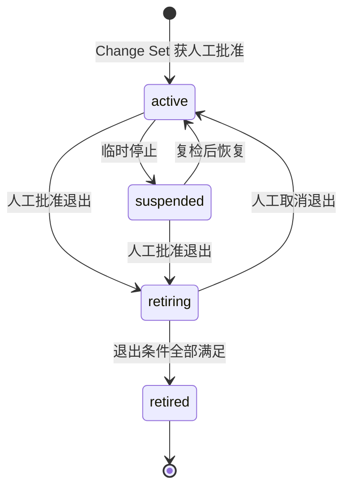
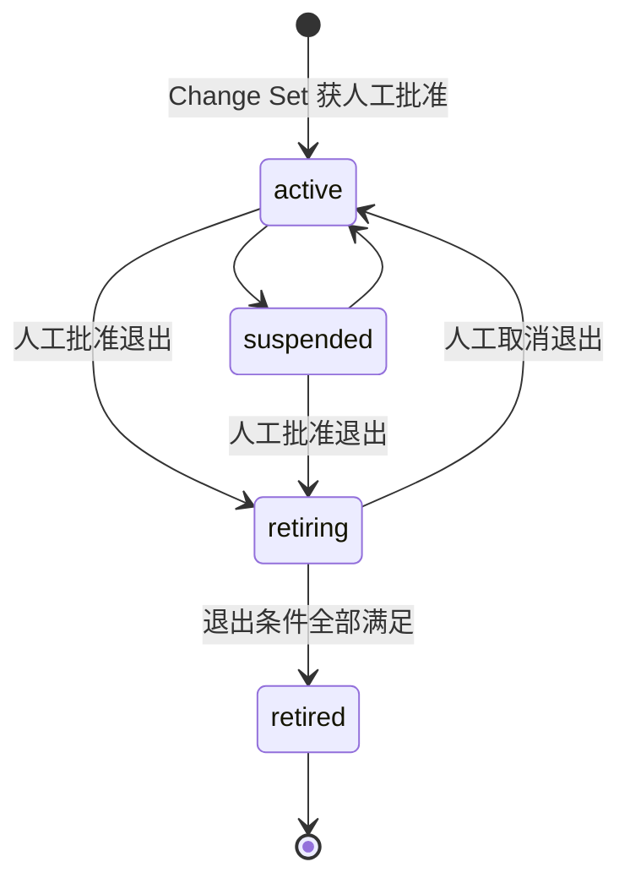
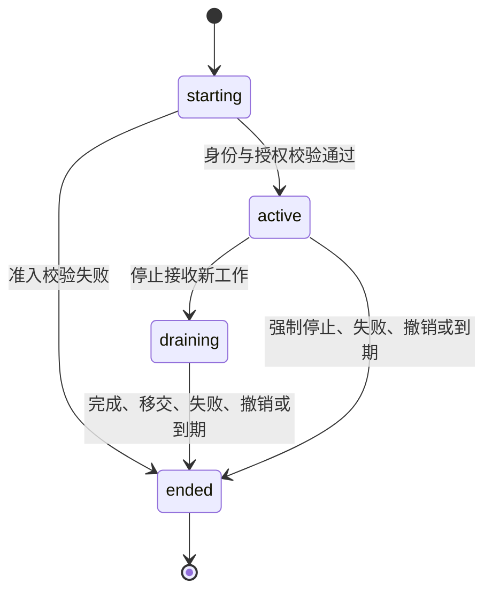

# 组织对象生命周期契约

状态：`approved-design`

本契约定义 Department、Position 和 Agent Instance 的最小生命周期、合法转换权限和退出前置条件。它不定义完整 Organization Snapshot/Event Schema；后续 Schema 必须使用本契约的状态语义，不能增加同义状态或把 Loop 状态复制到组织对象。

## 通用原则

1. 未批准 Department、Position 或 Preset 绑定只存在于 Organization Change Set，不使用 `proposed` 生命周期状态；
2. Department 与 Position 使用长期组织生命周期，Agent Instance 使用短期运行生命周期；
3. `retired` 和 `ended` 都是终态，稳定 ID 不得恢复或复用；
4. 跨部门迁移不是原地改 ID，而是退出旧 Position、创建新 Position，并用不可变 `migration_ref` 关联；
5. Position 空缺或占用、父 Department 暂停造成的不可用都是派生信息，不批量制造生命周期事件；
6. `blocked`、`paused`、`review` 和 `waiting_approval` 等生产状态属于 Loop，不进入 Agent Instance 生命周期。

## Department 生命周期



| 状态 | 含义 |
|---|---|
| `active` | 可以承担责任、包含正式 Position 并接收新工作 |
| `suspended` | 暂停接收新工作，但身份、职责、历史和恢复可能性仍保留 |
| `retiring` | 已批准退出，不再扩充编制，只允许完成、移交或关闭现有责任 |
| `retired` | 已退出终态，只保留历史、审批、迁移引用和 ID tombstone |

Department 进入 `retired` 前必须证明：

- 所有 Position 已迁移或进入 `retired`；
- 没有活动 Agent Instance；
- 没有活动 Loop 仍引用该 Department 的 Position 作为负责人或执行者；
- 事实源、文件所有权、预算和必要权限已移交或关闭；
- 独立 QA、审计和人工闸门没有失去必要承担者；
- 进入 `retiring` 所绑定的人工批准仍有效，且退出范围没有漂移。

## Position 生命周期

Position 使用与 Department 相同的四个长期状态：



Position 的 `active` 只表示岗位有效，不表示当前一定有运行实例。当前占用情况从 Agent Instance 计算：

```yaml
lifecycle_state: active
occupancy: vacant | occupied | overallocated
```

Position 进入 `retired` 前必须证明：

- 没有活动 Position Instance；
- 没有活动 Loop 仍引用该 Position；
- 长期职责、产物和文件所有权已经迁移或明确取消；
- 必要的独立验收关系已经由其他有效 Position 承担；
- 发生迁移时，已绑定新 Position ID 和不可变 `migration_ref`；取消职责时，已记录取消依据；
- 进入 `retiring` 所绑定的人工批准仍有效。

Position 更换 Agent Preset 版本、权限上限、长期职责、所有权或独立验收关系不是普通生命周期转换，必须通过 Organization Change Set 取得人工批准。

## Agent Instance 生命周期

Position Instance 与 Temporary Instance 共用同一运行生命周期，但准入依据不同：前者绑定已批准 Position，后者绑定有效临时授权。



| 状态 | 含义 |
|---|---|
| `starting` | 已分配 Instance ID，正在校验 Position 或授权、Preset、额度和有效期 |
| `active` | 准入条件有效，可以接收和执行工作 |
| `draining` | 不再接收新工作，只允许完成、取消或移交已有工作 |
| `ended` | 运行身份终态；后续重启或恢复必须创建新的 Instance ID |

`ended` 使用独立 `end_reason` 记录原因，不为每一种结束结果创建状态：

```yaml
end_reason: completed | stopped | expired | revoked | failed | startup_validation_failed
```

Instance 从 `starting` 进入 `active` 前必须验证：

- `instance_id` 从未使用；
- Preset ID、版本和摘要准确存在且仍有效；
- Position Instance 对应有效、未退出的 Position，并且绑定版本一致；
- Temporary Instance 拥有有效 `delegation_ref`、创建者身份和剩余额度；
- Department、Position、授权或安全策略没有使该实例的派生可用性失效。

准入失败必须进入 `ended` 并记录 `startup_validation_failed`，不能留下半活动实例。Instance 结束后不得恢复；需要继续工作时创建新 ID，并通过 `predecessor_instance_id` 保留关系。

## 派生状态

以下信息由结构化事实计算，不作为长期对象的生命周期状态：

| 派生字段 | 可能值 | 来源 |
|---|---|---|
| Position `occupancy` | `vacant`、`occupied`、`overallocated` | 当前未结束 Position Instance 数量与岗位并发上限 |
| Position `effective_availability` | `available`、`blocked_by_lifecycle`、`blocked_by_department`、`draining_only`、`blocked_by_binding`、`blocked_by_governance` | 自身生命周期、父 Department、Preset 绑定和治理检查 |
| Department `effective_capacity` | 项目定义的结构化容量摘要 | 有效 Position、活动 Instance 与授权额度 |

暂停 Department 时不得批量把所有子 Position 改成 `suspended`。子 Position 保持自身生命周期，由 `effective_availability: blocked_by_department` 表示当前不可用；恢复 Department 后重新计算派生状态。

- Position 自身处于 `suspended` 时，`effective_availability = blocked_by_lifecycle`。
- Position 或其所属 Department 处于 `retiring` 时，`effective_availability = draining_only`；只能完成退出、移交和清理工作，不得承接新工作。
- Position 自身可工作，但所属 Department 处于 `suspended` 时，`effective_availability = blocked_by_department`。

## 转换权限

| 转换或动作 | 默认权限与条件 |
|---|---|
| 创建 Department 或 Position | 必须由人工批准 Organization Change Set，批准后以 `active` 进入 Registry |
| `active → suspended` | 可由获得明确授权的项目经理执行；若导致长期职责缺失、绕过独立验收、改变所有权或形成无期限暂停，必须人工批准 |
| `suspended → active` | 由原暂停者或更高权限者完成复检后恢复；人工发起或人工保留原因导致的暂停必须由人工恢复 |
| `active/suspended → retiring` | 必须人工批准，并绑定 Change Set 摘要、退出范围和前置条件 |
| `retiring → retired` | 已有退出批准仍有效且全部退出条件满足时，由确定性协调器或获授权管理者完成，不重复请求同一退出决定 |
| `retiring → active` | 必须人工批准取消退出；不得静默恢复 |
| Position 更换 Preset 或长期权力边界 | 必须人工批准 Change Set |
| Position Instance 启动 | Position 和绑定有效时不重复人工审批 |
| Temporary Instance 启动 | 落在有效授权额度内时不逐个人工审批 |
| Instance 进入 `draining` 或 `ended` | 可由实例自身规则、获授权管理者、撤销或到期机制执行并留痕 |

暂停记录必须包含原因、授权、影响范围、开始时间、预计复检或到期时间和恢复条件。没有复检时间或到期时间的暂停视为无期限组织变更，必须升级人工审批。

## 转换不变量

- 每次生命周期转换都必须产生一个类型化 Organization Event，并与 Snapshot 更新原子完成；
- 状态转换不能顺便修改职责、权限、Preset 绑定、所有权或审批范围；这些变化必须由独立 Change Set 表达；
- 父对象不可用时优先计算派生可用性，不级联改写所有子对象；
- Department 或 Position 进入 `retired` 时，必须在同一原子更新中留下 ID tombstone；
- `retired` Department 或 Position 不得拥有新的活动 Instance 或活动 Loop 引用；
- `ended` Instance 不得接收新工作、恢复状态或复用 ID；
- 自动转换只能完成已经批准的意图或执行确定性准入、到期与撤销规则，不能替代人工组织判断。
